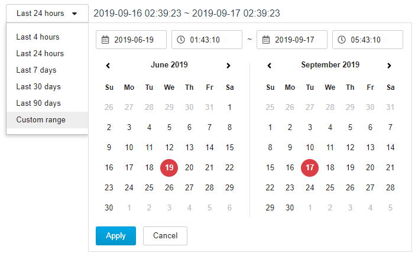

# vue-my-datepicker
> This is a datetimepicker for vue project

## Table of contents
* [General info](#general-info)
* [Screenshots](#screenshots)
* [Setup](#setup)
* [Available props and functions](#props)
* [Features](#features)
* [Status](#status)
* [Inspiration](#inspiration)
* [Contact](#contact)
* [Licence](#licence)

## General info
The datetime picker is follow boostrap style, but all of the Dependencies has been resolve in this components, you do not to install any other library anymore.

## Screenshots



## Setup
npm install vue-my-datepicker

## Available props and functions
| Props/methods          |  Type   | Default | Description
| :---                   | :----:  |  ----:  |
| timeRange              | Int     |     2   | The default selected timerange
| reloadFlag             | Boolean | false   | Used to reload the components, just need change this value to !reloadFlag, then the component will be relaod
| dataTimeLabelPosition  | String  | right   | where to show the timerange select panel, can be set to left
| initStart              | String  | null    | The default start time, no need to set if use local mode
| initEnd                | String  | null    | The default end time, no need to set if use local mode
| useLocalTime           | Booleas | true    | The default datetime mode of the component
| select-time-range      | function|N/A      | when use change the timerange inside component, <br>it will return the start time and end time to this function
| change-time-range      | function|N/A      | When use serve mode and change time range inside the component, this function will renturn <br>current time range, user need to get the datetime in server side by this time range and set start time <br> and end time to the component and trigger reload.

## Code Examples
Show examples of usage, for more example please refer to [github](https://github.com/biechao/vue-my-datetimepicker)
```
<template>
	<div>
		<vueMyDatepicker :param="local_param" v-on:select-time-range="customerSelectTimeRange"></vueMyDatepicker>
	</div>
</template>
<script>
import {vueMyDatepicker} from 'vue-my-datepicker'
import 'vue-my-datepicker/lib/vueMyDatepicker.css'

export default {
  name: 'app',
  components: {
    vueMyDatepicker
  },
  data(){
    return{
      local_param:{
        timeRange: 1,
        reloadFlag: false,
        dataTimeLabelPosition: 'right',
        initStart:"2019-09-16 01:43:10",
        initEnd:"2019-09-16 05:43:10",
        useLocalTime:true
      }
    }
  },
  methods:{
    customerSelectTimeRange(time_range){
      console.log(time_range);
    }
  }
}
</script>
```

## Features
Support local and serve datetime
* Local: use client datetime, the component will caculate the start time and end time in javascript
* Serve: use serve side datetime, you can provide start and end time to the component

To-do list:
* I18N support
* anything wonderful

## Status
Init version for now

## Inspiration
The component is based on [bootstrap datetimepicker](http://www.eyecon.ro/bootstrap-datepicker)

## Contact
Feel free to contact me here [github](https://github.com/biechao/vue-my-datetimepicker)

## Licence
MIT